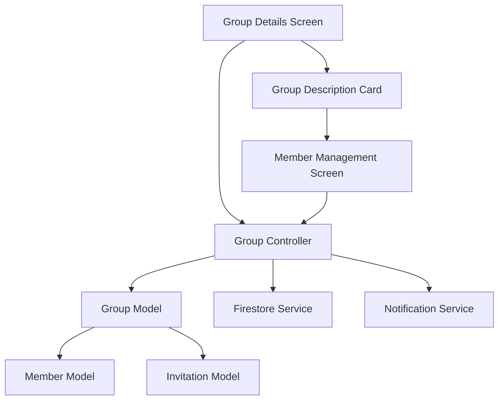

# Design Document: Group Details Flow Update

## Overview

This design outlines the architectural changes needed to update the Group Details flow in a Flutter application using GetX state management and Firestore backend. The solution addresses the current issues where all system users are displayed instead of actual group members, and provides proper separation between member display and invitation management.

The design follows Flutter/GetX best practices with reactive state management, proper data modeling for Firestore, and clear separation of concerns between UI components and business logic.

## Architecture

The updated architecture maintains the existing GetX pattern while introducing new components for proper member management:



### Key Architectural Changes

1. **Enhanced Group Model**: Updated to properly track accepted members vs. invited users
2. **New Member Management Screen**: Dedicated UI for invitation and member management
3. **Improved Group Controller**: Enhanced methods for member-specific operations
4. **Separated Concerns**: Clear distinction between viewing members and managing invitations

## Components and Interfaces

### Enhanced Group Model

The `GroupModel` will be updated to properly distinguish between different user states:

```dart
class GroupModel {
  final String id;
  final String name;
  final String description;
  final String adminId;
  final List<String> memberIds;        // Only accepted members
  final List<String> pendingInvites;   // Pending invitations
  final DateTime createdAt;
  final DateTime updatedAt;
  
  // Computed properties
  int get memberCount => memberIds.length;
  bool isAdmin(String userId) => adminId == userId;
  bool isMember(String userId) => memberIds.contains(userId);
  bool hasPendingInvite(String userId) => pendingInvites.contains(userId);
}
```

### Member Management Interface

```dart
abstract class MemberManagementInterface {
  Future<List<UserModel>> getGroupMembers(String groupId);
  Future<List<UserModel>> getAvailableUsers(String groupId);
  Future<void> inviteUser(String groupId, String userId);
  Future<void> removeMember(String groupId, String userId);
  Future<void> acceptInvitation(String groupId, String userId);
  Future<void> rejectInvitation(String groupId, String userId);
}
```

### Enhanced Group Controller

The `GroupController` will implement the member management interface and provide reactive state:

```dart
class GroupController extends GetxController implements MemberManagementInterface {
  // Reactive state
  final Rx<GroupModel?> currentGroup = Rx<GroupModel?>(null);
  final RxList<UserModel> groupMembers = <UserModel>[].obs;
  final RxList<UserModel> availableUsers = <UserModel>[].obs;
  final RxBool isLoading = false.obs;
  
  // Computed getters
  UserModel? get groupAdmin => groupMembers.firstWhereOrNull(
    (user) => currentGroup.value?.isAdmin(user.id) ?? false
  );
  
  List<UserModel> get regularMembers => groupMembers
    .where((user) => !currentGroup.value?.isAdmin(user.id) ?? true)
    .toList();
}
```

### UI Component Structure

#### Updated Group Details Screen
- Displays only accepted group members
- Shows admin at top with distinct styling
- Includes member count based on actual members
- Provides navigation to member management

#### New Member Management Screen
- Lists available users for invitation
- Shows invitation status for each user
- Provides member removal functionality for admins
- Integrates with existing notification system

#### Enhanced Group Description Card
- Adds dedicated "Manage Members" button
- Maintains existing group information display
- Provides clear navigation to member management

## Data Models

### Updated Group Document Structure (Firestore)

```json
{
  "id": "group_123",
  "name": "Development Team",
  "description": "Main development group",
  "adminId": "user_456",
  "memberIds": ["user_456", "user_789", "user_012"],
  "pendingInvites": ["user_345"],
  "createdAt": "2024-01-15T10:30:00Z",
  "updatedAt": "2024-01-20T14:45:00Z",
  "metadata": {
    "memberCount": 3,
    "lastActivity": "2024-01-20T14:45:00Z"
  }
}
```

### Member Status Tracking

```dart
enum MemberStatus {
  admin,
  member,
  invited,
  rejected,
  removed
}

class MembershipModel {
  final String userId;
  final String groupId;
  final MemberStatus status;
  final DateTime joinedAt;
  final DateTime? invitedAt;
  final String? invitedBy;
}
```

### User Model Enhancement

```dart
class UserModel {
  final String id;
  final String name;
  final String email;
  final String? avatarUrl;
  final List<String> groupIds;        // Groups user is member of
  final List<String> pendingInvites;  // Pending group invitations
  
  bool isMemberOf(String groupId) => groupIds.contains(groupId);
  bool hasInviteTo(String groupId) => pendingInvites.contains(groupId);
}
```

## Correctness Properties

*A property is a characteristic or behavior that should hold true across all valid executions of a system-essentially, a formal statement about what the system should do. Properties serve as the bridge between human-readable specifications and machine-verifiable correctness guarantees.*

### Property 1: Member Display Filtering
*For any* group with mixed user states (members, invited, non-members), the Group Details screen should display only users who have accepted invitations and are active members, with the member count matching the filtered list length.
**Validates: Requirements 1.1, 1.2, 1.3, 1.4**

### Property 2: Admin Identification and Display
*For any* group, the group admin should always appear at the top of the member list with distinct visual styling and appropriate admin labeling.
**Validates: Requirements 2.1, 2.2, 2.3, 2.4**

### Property 3: UI Separation and Navigation
*For any* group description card, it should contain a dedicated member management button that navigates to the member management screen, and the member list should not contain invitation functionality.
**Validates: Requirements 3.1, 3.2, 3.3, 3.4**

### Property 4: Member Management Screen Functionality
*For any* group, the member management screen should display available users for invitation with correct status information, provide removal functionality for admins, and clearly separate invited users from active members.
**Validates: Requirements 4.1, 4.2, 4.3, 4.4, 4.5**

### Property 5: Group Model Data Integrity
*For any* group model, it should maintain separate lists for active members and pending invitations, store admin identification, support active member queries, and include complete member status in serialization.
**Validates: Requirements 5.1, 5.2, 5.3, 5.4, 5.5**

### Property 6: Controller Member Operations
*For any* group controller operation, member retrieval should return only active members, add/remove operations should properly update member lists, and admin permissions should be validated before modifications.
**Validates: Requirements 6.1, 6.2, 6.3, 6.4, 6.5**

### Property 7: System Integration Compatibility
*For any* invitation or member management operation, it should integrate properly with existing notification systems, maintain backward compatibility, and trigger appropriate notifications for member changes.
**Validates: Requirements 7.1, 7.2, 7.3, 7.4**

## Error Handling

### Member Access Errors
- **Invalid Group Access**: Handle cases where users attempt to access groups they're not members of
- **Permission Denied**: Graceful handling when non-admins attempt admin operations
- **Network Failures**: Offline support and retry mechanisms for Firestore operations

### Data Consistency Errors
- **Stale Data**: Handle cases where local state doesn't match Firestore state
- **Concurrent Modifications**: Resolve conflicts when multiple users modify group membership simultaneously
- **Invalid Member States**: Handle corrupted data where users appear in both member and invitation lists

### UI Error States
- **Loading States**: Proper loading indicators during member data fetching
- **Empty States**: Appropriate messaging when groups have no members or available users
- **Network Errors**: User-friendly error messages with retry options

### Error Recovery Strategies
```dart
class GroupErrorHandler {
  static void handleMembershipError(Exception error) {
    if (error is PermissionDeniedException) {
      showPermissionDeniedDialog();
    } else if (error is NetworkException) {
      showRetryDialog();
    } else {
      showGenericErrorDialog();
    }
  }
  
  static Future<void> recoverFromDataInconsistency() async {
    // Force refresh from Firestore
    await GroupController.to.refreshGroupData();
  }
}
```

## Testing Strategy

### Dual Testing Approach

The testing strategy employs both unit tests and property-based tests to ensure comprehensive coverage:

**Unit Tests**: Focus on specific examples, edge cases, and integration points
- Test specific user scenarios (admin removing member, user accepting invitation)
- Test error conditions (network failures, permission denials)
- Test UI component rendering with known data sets
- Test Firestore integration with mock data

**Property-Based Tests**: Verify universal properties across all inputs
- Generate random groups with various member configurations
- Test filtering and display logic across all possible user states
- Verify data model consistency with randomized operations
- Validate controller behavior with generated test data

### Property-Based Testing Configuration

Using the `faker` package for Flutter to generate test data:

```dart
// Example property test configuration
testWidgets('Property 1: Member Display Filtering', (tester) async {
  // Generate random group with mixed user states
  final group = GroupGenerator.generateRandomGroup();
  final users = UserGenerator.generateMixedUsers(group);
  
  // Test that only active members are displayed
  await tester.pumpWidget(GroupDetailsScreen(group: group));
  
  final displayedUsers = find.byType(MemberListItem);
  expect(displayedUsers.evaluate().length, equals(group.memberIds.length));
  
  // Verify no pending invites are shown
  for (final pendingId in group.pendingInvites) {
    expect(find.text(users[pendingId]!.name), findsNothing);
  }
});
```

**Test Configuration Requirements**:
- Minimum 100 iterations per property test
- Each test tagged with: **Feature: group-details-flow-update, Property {number}: {property_text}**
- Use `flutter_test` with `faker` for data generation
- Mock Firestore operations for consistent testing

### Integration Testing

- Test complete user flows from group creation to member management
- Verify notification system integration with member operations
- Test offline/online synchronization scenarios
- Validate real-time updates across multiple user sessions

### Performance Testing

- Test member list rendering with large groups (1000+ members)
- Verify Firestore query performance with complex member filters
- Test memory usage during extensive member management operations
- Validate UI responsiveness during data loading operations